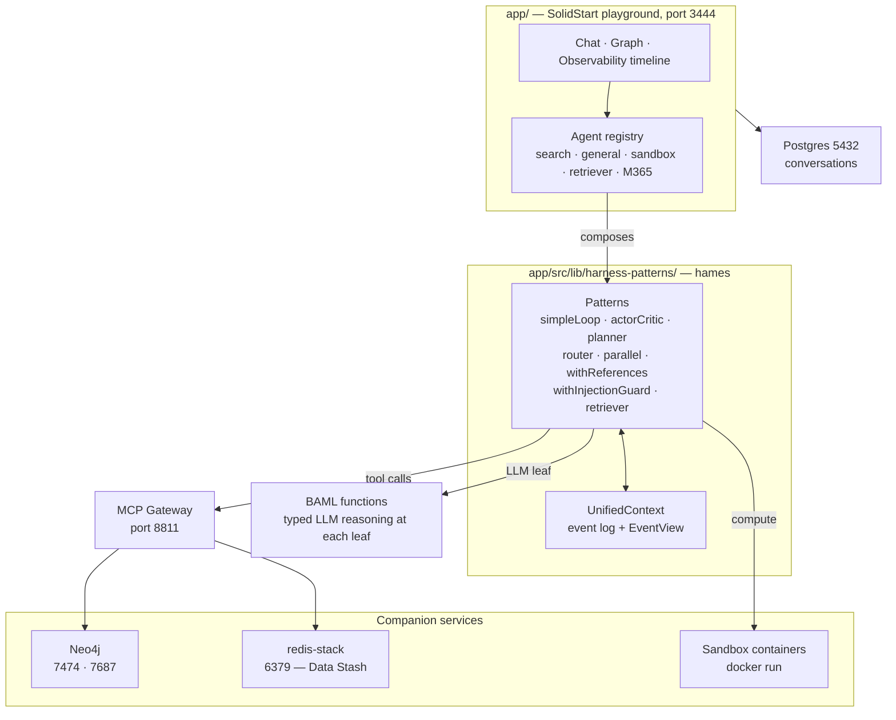

<div align="center">

<picture>
  <source media="(prefers-color-scheme: dark)" srcset="docs/harness-patterns/hames_light-text-on-transparent-bg.png">
  <source media="(prefers-color-scheme: light)" srcset="docs/harness-patterns/hames_dark-text-on-transparent-bg.png">
  
</picture>

### Application Lab for harness primitives

**MVP stage** · [What it is](#what-this-is) · [hames](#hames--the-primitives) · [Architecture](#architecture) · [Security](#security-disclaimer) · [Quickstart](#quickstart) · [Agents](#agents) · [Docs](#documentation)

</div>

---

## What this is

**hames-playground** is the application lab for **hames** — a small set of
composable primitives for building LLM agents. The primitives are the point;
this repo is where they get proven against real work.

The lab gives each primitive somewhere to be wrong in public: a SolidStart app
with a chat surface, a live event timeline, an interactive graph, and a handful
of agents that compose the primitives differently on purpose. If a pattern only
looks right in a README, it shows up here.

**Status: MVP.** The API still moves, the agents are showcases rather than
products, and nothing here has been hardened for a public deployment — see
[Security disclaimer](#security-disclaimer) before you run it anywhere but
localhost.

## hames — the primitives

`hames` is a functional pattern framework for agentic tool execution. A pattern
is a function of `(scope, view, tools)` that reads and appends to one
**`UnifiedContext`** event log; patterns compose into an agent and stay
independent in semantics, so one can be swapped without disturbing the others.

|                        |                                                                       |
| ---------------------- | --------------------------------------------------------------------- |
| **Loops**              | `simpleLoop` · `actorCritic`                                          |
| **Planning & routing** | `planner` · `router` · `routes` · `parallel`                          |
| **Context**            | `withReferences` · `retriever` · `compactExecution` · `compactIntent` |
| **Guards**             | `withInjectionGuard`                                                  |
| **Composition**        | `chain` · `harness` · `continueSession` · `resumeHarness`             |

BAML supplies typed LLM reasoning at each pattern's leaf; an MCP gateway
supplies the tools. Neither is baked in — the library is being pulled towards a
BAML-free core behind injected call interfaces
([`docs/plan/harness-npm-lib.md`](docs/plan/harness-npm-lib.md)).

📖 **[Read the hames README →](app/src/lib/harness-patterns/README.md)** — full
API, `UnifiedContext` architecture, the `EventView` query API, and the
event→BAML type mapping.

One primitive worth a closer look: **`withReferences`** carries data across
turns without re-fetching. The agent searches the web on one turn and writes the
findings into Neo4j on the next — an LLM-driven selector attaches the relevant
prior `tool_result` events at the new pattern's ingress, and the controller pulls
the full payload through the synthetic `expandPreviousResult` tool. No
re-fetching, no hallucinated content.
→ [Walkthrough](docs/harness-patterns/withReferences-tutorial.md) ·
[Design](docs/harness-patterns/with-references.md)

## Architecture



Events flow one way: every pattern appends to the `UnifiedContext` log, the UI
streams that log over SSE, and `compactExecution` turns the accumulated events
into the final answer. Session state is the serialized log, nothing else.

## Security disclaimer

**⚠️ This is MVP-stage software. Do not expose it to the internet without your own
security review.**

- **It runs LLM agents that hold real tool access.** Agents execute Cypher
  against Neo4j, read and write the filesystem through MCP, shell out to
  `docker run` for compute sandboxes, and — for the Microsoft 365 agent — act on
  a signed-in user's own mailbox and files with delegated Graph scopes. Prompt
  content reaches those tools.
- **`'use server'` hardening is ongoing.** Several unauthenticated server-action
  holes were closed in #227 / #229, but the work is not finished:
  [#230](https://github.com/mknw/hames-playground/issues/230) is **open** —
  `runManualCypher` still accepts raw Cypher behind a substring blacklist.
- **Auth is off by default for development.** `app/.env.example` ships
  `VITE_DEV_BYPASS_AUTH='true'`. A real deployment needs the Entra sign-in wired
  and the bypass off ([`docs/deployment/entra-setup.md`](docs/deployment/entra-setup.md)).
- **The compose stack publishes its databases on `0.0.0.0`.** Convenient on a
  laptop, an internet-exposed database on a VM. Bind them to loopback first —
  [`docs/deployment/azure-vm.md` §4](docs/deployment/azure-vm.md).
- **Prompt injection is mitigated, not solved.** `withInjectionGuard` screens
  tool results before they reach a controller (#207). Treat it as defence in
  depth, not a boundary you can trust with real secrets.

Run it on localhost, against data you can afford to lose, with API keys you can
rotate.

## Quickstart

**Requirements:** Docker Desktop · Node.js >= 22 · pnpm

```bash
git clone git@github.com:mknw/hames-playground.git
cd hames-playground

# 1. Backing services: Neo4j, Postgres, redis-stack, MCP gateway
docker compose up -d
docker compose ps                 # wait for healthy

# 2. Seed the graph
./scripts/import-neo4j.sh neo4j_dumps/seed-data.cypher

# 3. Configure — ANTHROPIC_API_KEY is the one required key
cd app
cp .env.example .env              # then fill in ANTHROPIC_API_KEY

# 4. Run
pnpm install
pnpm dev                          # http://localhost:3444
```

The app runs natively on the host on purpose — that is the development loop, and
step 1 deliberately does not start it. A container shape exists for
deployment parity (`docker compose --profile app up -d`); see
[`docs/DOCKER_COMPOSE.md`](docs/DOCKER_COMPOSE.md#app-the-solidstart-app-197).

**Every `pnpm` command runs from `app/`** — never npm/npx, never from the repo
root. Re-run `pnpm baml-generate` after editing anything under `app/baml_src/`.

|               |                                                          |
| ------------- | -------------------------------------------------------- |
| App           | <http://localhost:3444>                                  |
| Neo4j Browser | <http://localhost:7474> — `neo4j` / `password`           |
| MCP Gateway   | <http://localhost:8811/mcp>                              |
| Postgres      | `localhost:5432` — `postgres` / `password`, db `kgagent` |

## Agents

Each agent is a different composition of the same primitives — that is what they
are for. Registered in
[`app/src/lib/harness-client/registry.server.ts`](app/src/lib/harness-client/registry.server.ts).

| Agent                   | Composition                                                                       | What it shows                                                                                                                              |
| ----------------------- | --------------------------------------------------------------------------------- | ------------------------------------------------------------------------------------------------------------------------------------------ |
| **Search**              | `router` → `routes(withReferences(simpleLoop))` → `compactExecution`              | Classify into one namespace and dispatch — Neo4j or web search. The `web` route is injection-guarded, `neo4j` is not                       |
| **General**             | `planner` → `simpleLoop` → `compactExecution`                                     | Pay for strategy once, up front, then hand the whole tool surface to one executor. The A/B counterpart to Search on cross-domain questions |
| **Sandbox · Session**   | `compactIntent` → `withSandbox(actorCritic)` → `compactExecution`                 | A container keyed to the session, persistent across turns and shared with the interactive Shell — build incrementally, inspect files live  |
| **Sandbox · Flavoured** | `router` → `routes(withSandbox(actorCritic))` → `compactExecution`                | One route per purpose-built flavour: base, image-processing, data, office                                                                  |
| **Retriever**           | `router` → `routes(retriever \| withReferences(simpleLoop))` → `compactExecution` | Semantic retrieval over uploaded documents (Data Stash) as a peer route beside Neo4j and web                                               |
| **Microsoft 365**       | `withInjectionGuard(simpleLoop)` → `compactExecution`                             | Per-user identity end to end — answers from the signed-in user's own mailbox, calendar and files via delegated Graph scopes                |

`multi-source-research` (a worked `parallel` example) ships unregistered and
untested — see its file header. Writing a new agent is two steps:
[`app/src/lib/harness-client/agents/README.md`](app/src/lib/harness-client/agents/README.md).

## Documentation

📚 **[`docs/INDEX.md`](docs/INDEX.md) is the index** — every doc, with a sentence
on what each one holds.

The ones reached most often:

|                                                                                                   |                                                                                |
| ------------------------------------------------------------------------------------------------- | ------------------------------------------------------------------------------ |
| [`app/src/lib/harness-patterns/README.md`](app/src/lib/harness-patterns/README.md)                | The hames API reference                                                        |
| [`GLOSSARY.md`](GLOSSARY.md)                                                                      | House vocabulary — pattern, controller, critic, harness, EventView, Data Stash |
| [`docs/plan/ROADMAP.md`](docs/plan/ROADMAP.md)                                                    | Roadmap shape: multi-user target architecture, phased MoSCoW plan              |
| [`docs/plan/harness-npm-lib.md`](docs/plan/harness-npm-lib.md)                                    | Extracting `hames` to npm — package layout, dev vs. production loading         |
| [`docs/DOCKER_COMPOSE.md`](docs/DOCKER_COMPOSE.md) · [`docs/MCP_GATEWAY.md`](docs/MCP_GATEWAY.md) | Services, adding an MCP server, gateway troubleshooting                        |
| [`docs/DATA_STASH.md`](docs/DATA_STASH.md)                                                        | Upload → chunk → embed → search pipeline                                       |
| [`docs/adr/`](docs/adr/README.md)                                                                 | Decision records — and when one gets written                                   |
| [GitHub Project](https://github.com/users/mknw/projects/5)                                        | The live planning board                                                        |

## License

Two licenses, split along the library boundary:

| Scope                                                   | License                                     |
| ------------------------------------------------------- | ------------------------------------------- |
| `app/src/lib/harness-patterns/` — the **hames** library | [MIT](app/src/lib/harness-patterns/LICENSE) |
| Everything else — the **playground**                    | [PolyForm Noncommercial 1.0.0](LICENSE)     |

Copyright (c) 2026 Michael Accetto. **Both require attribution.** The library is
MIT so it is usable anywhere, including commercially, once extracted. The
playground around it is noncommercial: run it, study it, modify it, self-host it
locally or in the cloud — but not for a commercial purpose.

Third-party notices are unaffected by either: the vendored files listed in
[`.claude/skills/NOTICE.md`](.claude/skills/NOTICE.md) keep their own licenses,
with upstream pins recorded in
[`.claude/skills/PROVENANCE.md`](.claude/skills/PROVENANCE.md).
