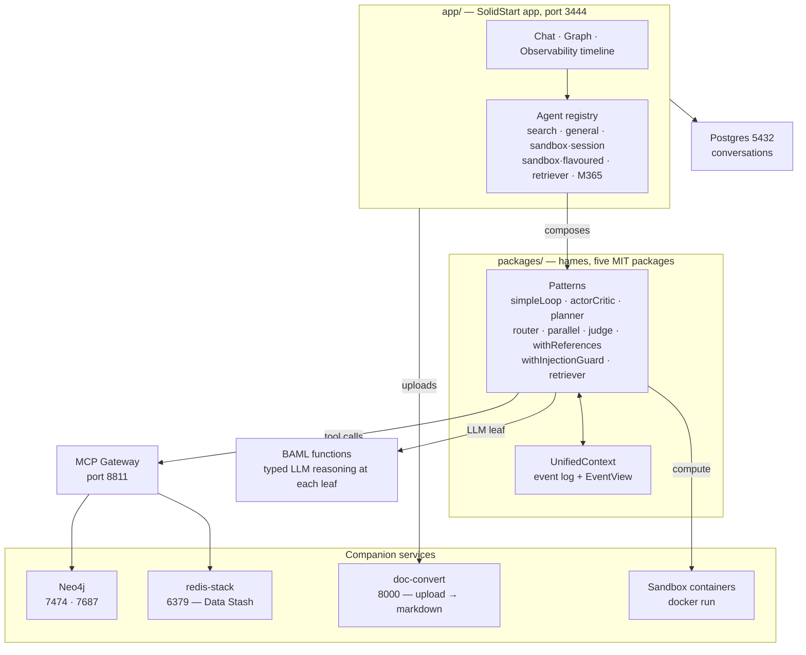

<div align="center">

<picture>
  <source media="(prefers-color-scheme: dark)" srcset="docs/harness-patterns/hames_light-text-on-transparent-bg.png">
  <source media="(prefers-color-scheme: light)" srcset="docs/harness-patterns/hames_dark-text-on-transparent-bg.png">
  
</picture>

### The hames app

A self-hosted agent workspace: chat with agents that search the web, query a
knowledge graph, run code in isolated containers, and answer from your own
documents and Microsoft 365 — with every step of every run visible in the UI.

The agents are compositions of **hames**: five MIT-licensed packages under
[`packages/`](packages/) — `@hames/harness-patterns` and its `harness-baml`,
`agents`, `connectors` and `sandbox` companions — which this app consumes as
workspace dependencies. They are typed agent primitives — loops, planners,
routers, guards — where the run's history is the primary object and each LLM
call sees only a slice chosen on purpose.

[](https://github.com/mknw/hames-playground/actions/workflows/ci.yml)
[](https://github.com/mknw/hames-playground/commits/main)
[](#the-idea)
[](LICENSE)
[](packages/harness-patterns/LICENSE)

[](https://start.solidjs.com)
[](https://docs.boundaryml.com)
[](https://pnpm.io)

[Features](#what-you-can-do-with-it) · [Quickstart](#quickstart) · [Tutorials](#tutorials) · [Roadmap](#roadmap) · [Architecture](#architecture) · [Primitives](#hames--the-primitives) · [Agents](#agents) · [Docs](#documentation) · [Contributing](#contributing) · [License](#license)

<!-- TODO: a screenshot of the running app belongs here (issue #315, G1) — do not ship a placeholder image. -->

</div>

> **⚠️ MVP stage — use at your own discretion.** These agents hold real tool
> access, and nothing here has been hardened for a deployment you do not control.
> Run it on localhost, against data you can afford to lose, with keys you can
> rotate — and read the [License](#license) before you do anything else with it.

---

## What you can do with it

- **Agents that act** — web search, Neo4j knowledge-graph queries and code
  execution in disposable Docker containers, composed per agent
- **Your documents** — upload files into a local Data Stash (chunked, embedded,
  7-day retention); semantic retrieval is a first-class route beside web and graph
- **Your Microsoft 365 identity** — per-user delegated access; the M365 agent
  answers from the signed-in user's own mailbox, calendar and files
- **Composable primitives** — loops, actor-critic, planning, routing, context
  compaction and an injection guard for untrusted content; a new agent is a
  definition plus a registration
- **Typed LLM calls** — prompts live in version-controlled BAML files with
  declared input and output types; a parse failure is a typed error event, not a
  string you hope parses
- **Full observability** — every run streams its event log to the UI: prompts,
  tool results, cost per step, and a live graph of what the agent touched

## The idea

Every agent framework eventually collides with the same wall: the transcript.
It grows every turn, everything gets pasted into everything, and by turn five the
model is reasoning over a pile of text nobody deliberately chose for it. `hames`
starts from the other end. The run's history is the primary object, and what any
one LLM call sees is a slice of it that somebody picked on purpose.

That object is the **`UnifiedContext`** — one append-only event log per session,
where every pattern (a loop, a router, a planner, a guard) reads and appends, and
where nothing else counts as state. Patterns write into an isolated scope first
and commit only on completion, so a step that fails leaves no trace behind. A
session _is_ its serialized log, which is why continuing a conversation and
resuming after an approval gate are the same mechanism rather than two features.

**Views and scopes** are how the slice gets picked. `EventView` is a small query
API over the log — by pattern, by event type, by the last N user turns — so a
synthesizer can be handed exactly the tool results of the route that just ran,
and a router just the message history it needs to classify. `ViewConfig` declares
that per pattern instead of at every call site, so detail from three turns ago
expires by construction instead of by someone remembering to prune it.

The LLM leaf of every primitive is a **BAML** function, and that was the point of
choosing BAML: prompts live in version-controlled `.baml` files with declared
input and output types, so a controller returns a validated `ControllerAction`
instead of a string you hope parses, model fallback chains sit next to the prompt
they serve, and a parse failure arrives as a typed `error` event in the same log
as everything else. Prompts as code — not string soup.

## Quickstart

**Requirements:** Docker Desktop (or an equivalent Docker engine) · Node.js >= 22 · pnpm
· on Apple Silicon, redis runs under `platform: linux/amd64` (pinned in
`docker-compose.yaml` — the arm64 RediSearch build crashes).

```bash
git clone https://github.com/mknw/hames-playground.git
cd hames-playground

# 1. Backing services — Postgres, Neo4j, redis-stack, the MCP gateway and
#    doc-convert. The app itself runs on the host (step 5).
docker compose up -d
docker compose ps                 # all five services should be Up

# 2. Seed the graph — imports a small demo knowledge graph so the graph tools
#    and the UI's graph views have data to query on a first run (optional but
#    recommended). The script refuses to clear a container that already holds
#    data unless you pass --wipe, and honours NEO4J_CONTAINER if yours is
#    named differently.
./scripts/import-neo4j.sh neo4j_dumps/seed-data.cypher

# 3. Install — at the REPO ROOT. That is what links the workspace packages
#    `app/` consumes; an install run only inside app/ leaves them unlinked.
pnpm install

# 4. Configure — two keys are required
cd app
cp .env.example .env
openssl rand -base64 32           # this becomes DATA_ENCRYPTION_KEY
```

In `app/.env`, set **`ANTHROPIC_API_KEY`** (the only AI-provider key the app
needs) and **`DATA_ENCRYPTION_KEY`** (generated above) — conversations are
encrypted at rest, and with the key left empty the app boots but cannot save a
single conversation. Back the encryption key up separately from the database: a
dump without it is unreadable.

> **Already running another copy of this app on this machine?** The compose file
> pins a project name and fixed container names, and the app's defaults point at
> `localhost:5432/6379/7687` — a second `docker compose up -d` will adopt and
> recreate the existing stack's containers. Stop the other stack first.

```bash
# 5. Run (from app/)
pnpm dev                          # http://localhost:3444
```

Open <http://localhost:3444> — you should see the chat interface with the agent
list in the sidebar. Sign-in is bypassed in development
(`VITE_DEV_BYPASS_AUTH='true'`), so you land straight in the app. Type a message
and pick an agent to watch a first run stream in.

By default every agent call runs on Anthropic. A self-hosted inference tier
exists as an opt-in for deployments that must keep prompts on their own
infrastructure — see `USE_VERDA_INFERENCE` in `app/.env.example`.

**The install runs at the repo root; every `pnpm` _script_ runs from `app/`** —
never npm/npx. `app/` consumes the five packages through `workspace:*`, and
those links are created by a root-level install; a `predev` guard
([`app/scripts/check-workspace-links.mjs`](app/scripts/check-workspace-links.mjs))
checks them before the dev server starts and repairs them by running
`pnpm install --frozen-lockfile` at the root. The BAML corpus is
`packages/harness-baml/baml_src/` and its generated `baml_client/` is committed
beside it, so nothing needs generating to run the app; after editing a `.baml`
file, re-run `pnpm baml-generate` **from `packages/harness-baml/`** and commit
the regenerated client.

|               |                                                          |
| ------------- | -------------------------------------------------------- |
| App           | <http://localhost:3444>                                  |
| Neo4j Browser | <http://localhost:7474> — `neo4j` / `password`           |
| MCP Gateway   | <http://localhost:8811/mcp>                              |
| Postgres      | `localhost:5432` — `postgres` / `password`, db `kgagent` |

App-specific detail — the dev scripts, what actually lives under `app/src/`, and
how the app consumes the five packages — is in
[`app/README.md`](app/README.md).

Auth is bypassed for development (`VITE_DEV_BYPASS_AUTH='true'` in
`app/.env.example`), the compose stack publishes its databases on `0.0.0.0` with
laptop-default passwords, and both need attention before this runs anywhere but
your own machine — [`docs/deployment/azure-vm.md`](docs/deployment/azure-vm.md)
and [`docs/deployment/entra-setup.md`](docs/deployment/entra-setup.md) cover the
hardening, and [`docs/PREVIEW.md`](docs/PREVIEW.md) is the step-by-step runbook
for a single-VM deployment.

## Tutorials

Task-shaped pages for building **on** the `@hames` packages — pick the one that
names what you are trying to do, follow it start to finish, have it working in
ten minutes. Index, install matrix and suggested reading order:
[`docs/tutorials/README.md`](docs/tutorials/README.md). Every TypeScript fence in
them is compiled against the real packages by
[`app/src/__tests__/docs/tutorials-docs-pins.test.ts`](app/src/__tests__/docs/tutorials-docs-pins.test.ts),
so a page that drifts from the shipped surface fails CI.

| Tutorial                                                                         | You will build                                                                                                                                    |
| -------------------------------------------------------------------------------- | ------------------------------------------------------------------------------------------------------------------------------------------------- |
| [Hosting the harness](docs/tutorials/hosting-the-harness.md)                     | Running a turn from your own application: the run frame a turn opens, its five slots, what breaks when you skip it, and one complete host to copy |
| [Wiring a host](docs/tutorials/wiring-a-host.md) **(stub)**                      | The composition root: boot-time seams, the one `AgentDeps` bag, and the registration overlay                                                      |
| [Guarding an agent](docs/tutorials/guarding-an-agent.md)                         | A loop over a hostile tool, wrapped in the injection guard — and the exact event a caught injection produces                                      |
| [Running code in a sandbox](docs/tutorials/running-code-in-a-sandbox.md)         | A sandboxed pattern: egress profiles, attachment lifetimes, and per-turn flavour selection                                                        |
| [Attaching a sandbox workspace](docs/tutorials/attaching-a-sandbox-workspace.md) | The durable `/work` seam — a workspace store, `syncWorkspace`, and the tenant boundary                                                            |
| [Bring your own provider or model](docs/tutorials/own-provider-or-model.md)      | The shipped agents calling a model you supply — a different provider or a self-hosted endpoint — without touching prompts                         |

The **stub** marker is the page's own: _Wiring a host_ names the seam now and
gains its worked example when the composition-root rewrite
([#374](https://github.com/mknw/hames-playground/issues/374)) lands.

## Roadmap

The active plan is multi-user readiness, and two reframes drive it: the MCP
gateway is the **shared / org-identity** tool boundary rather than the one shop
for all tools, and isolation is **physical, never LLM self-scoping** — scoping
binds to the connection, not to query text. Entra SSO (#119) is the gate: it
carries external lead time and gates five workstreams, with threading a real
`userId` through the remaining gaps, org-identity RBAC, per-user Neo4j graphs
via DozerDB and Entra OBO for Microsoft 365 behind it. Standing decisions the
plan encodes: a ~30-user forecast, a single VM with compose and Caddy for this
whole cycle, and Microsoft-only per-user identity — a general per-user
credential vault is an explicit Won't-have this cycle.

The phase breakdown (Phase 0–4, each item rated Must / Should / Could / Won't)
lives in [`docs/plan/ROADMAP.md`](docs/plan/ROADMAP.md) and is not duplicated
here. Live item tracking — Status, Priority, and the `MSCW` field that mirrors
those ratings — is on the
[GitHub project board](https://github.com/users/mknw/projects/5).

## Architecture



Events flow one way: every pattern appends to the `UnifiedContext` log, the UI
streams that log over SSE, and `compactExecution` turns the accumulated events
into the final answer.

Not drawn: the optional **self-hosted inference tier**. With
`USE_VERDA_INFERENCE=1`, or a per-conversation switch in the UI, the BAML leaf
calls above go to a private endpoint instead of Anthropic; the boxes and arrows
are otherwise the same.

## hames — the primitives

A pattern is a function of `(scope, view, tools)` over that one event log.
Patterns stay independent in semantics, so one can be swapped without disturbing
the others — which is the whole reason the app can hold several agents that
differ only in how they compose these:

|                                     |                                                                       |
| ----------------------------------- | --------------------------------------------------------------------- |
| **Loops**                           | `simpleLoop` · `actorCritic`                                          |
| **Planning, routing and selection** | `planner` · `router` · `routes` · `parallel` · `judge`                |
| **Context**                         | `withReferences` · `retriever` · `compactExecution` · `compactIntent` |
| **Guards**                          | `withInjectionGuard`                                                  |
| **Composition**                     | `chain` · `harness` · `continueSession` · `resumeHarness`             |

BAML supplies the typed reasoning at each leaf; an MCP gateway supplies the
tools. Neither is baked in: the core package is BAML-free and takes its LLM
functions as injected config — `@hames/harness-baml` is the reference
implementation of that seam, and a consumer can supply another
([`docs/plan/harness-npm-lib.md`](docs/plan/harness-npm-lib.md)).

📖 **[Read the hames front page →](packages/harness-patterns/README.md)** — what
the primitives are and why they are shaped that way. Beside it,
[GUIDE.md](packages/harness-patterns/GUIDE.md) is the developer guide (the
composition model, how to write your own pattern, the tool-transport seam), and
[SPEC.md](packages/harness-patterns/SPEC.md) carries the full API, the
`UnifiedContext` architecture, the `EventView` query API and the event→BAML type
mapping.

One primitive worth a closer look: **`withReferences`** carries data across turns
without re-fetching. The agent searches the web on one turn and writes the
findings into Neo4j on the next — an LLM-driven selector attaches the relevant
prior `tool_result` events at the new pattern's ingress, and the controller pulls
the full payload through the synthetic `expandPreviousResult` tool. No
re-fetching, no hallucinated content.
→ [Walkthrough](docs/harness-patterns/withReferences-tutorial.md) ·
[Design](docs/harness-patterns/with-references.md)

## Agents

Each agent is a different composition of the same primitives — that is what they
are for. The definitions live in
[`packages/agents/agents/`](packages/agents/agents/); the app registers them,
overlaying an icon and an accent colour, in
[`app/src/lib/harness-client/registry.server.ts`](app/src/lib/harness-client/registry.server.ts).

| Agent                   | Composition                                                                                           | What it shows                                                                                                                                                                                                                       |
| ----------------------- | ----------------------------------------------------------------------------------------------------- | ----------------------------------------------------------------------------------------------------------------------------------------------------------------------------------------------------------------------------------- |
| **Search**              | `router` → `routes(withReferences(simpleLoop))` → `compactExecution`                                  | Classify into one namespace and dispatch — Neo4j or web search. The `web` route is injection-guarded, `neo4j` is not                                                                                                                |
| **General**             | `planner` → `simpleLoop` → `compactExecution`                                                         | Pay for strategy once, up front, then hand the whole tool surface to one executor. The A/B counterpart to Search on cross-domain questions                                                                                          |
| **Sandbox · Session**   | `compactIntent` → `withSandbox(actorCritic)` → `compactExecution`                                     | A container keyed to the session, persistent across turns and shared with the interactive Shell — build incrementally, inspect files live                                                                                           |
| **Sandbox · Flavoured** | `router` → `routes(withSandbox(actorCritic))` → `compactExecution`                                    | One route per purpose-built flavour: base, image-processing, data, office                                                                                                                                                           |
| **Retriever**           | `router` → `withInjectionGuard(routes(retriever \| withReferences(simpleLoop)))` → `compactExecution` | Semantic retrieval over uploaded documents (Data Stash) as a peer route beside Neo4j and web. The guard covers both untrusted routes — `web` and `retriever`, whose chunks come from ingested files — while `neo4j` stays unguarded |
| **Microsoft 365**       | `withInjectionGuard(simpleLoop)` → `compactExecution`                                                 | Per-user identity end to end — answers from the signed-in user's own mailbox, calendar and files via delegated Graph scopes                                                                                                         |

## Documentation

📚 **[`docs/INDEX.md`](docs/INDEX.md) is the index** — every doc, with a sentence
on what each one holds.

The ones reached most often:

|                                                                                                   |                                                                                |
| ------------------------------------------------------------------------------------------------- | ------------------------------------------------------------------------------ |
| [`docs/tutorials/README.md`](docs/tutorials/README.md)                                            | Task-shaped tutorials for building on the `@hames` packages                    |
| [`packages/harness-patterns/SPEC.md`](packages/harness-patterns/SPEC.md)                          | The hames API reference and design spec                                        |
| [`GLOSSARY.md`](GLOSSARY.md)                                                                      | House vocabulary — pattern, controller, critic, harness, EventView, Data Stash |
| [`docs/plan/ROADMAP.md`](docs/plan/ROADMAP.md)                                                    | Roadmap shape: multi-user target architecture, phased MoSCoW plan              |
| [`docs/plan/harness-npm-lib.md`](docs/plan/harness-npm-lib.md)                                    | Extracting `hames` to npm — package layout, dev vs. production loading         |
| [`docs/DOCKER_COMPOSE.md`](docs/DOCKER_COMPOSE.md) · [`docs/MCP_GATEWAY.md`](docs/MCP_GATEWAY.md) | Services, adding an MCP server, gateway troubleshooting                        |
| [`docs/DATA_STASH.md`](docs/DATA_STASH.md)                                                        | Upload → chunk → embed → search pipeline                                       |
| [`docs/adr/`](docs/adr/README.md)                                                                 | Decision records — and when one gets written                                   |
| [GitHub Project](https://github.com/users/mknw/projects/5)                                        | The live planning board                                                        |

## Help

Something not working? Start with
[`docs/DOCKER_COMPOSE.md`](docs/DOCKER_COMPOSE.md) (backing services) and
[`docs/MCP_GATEWAY.md`](docs/MCP_GATEWAY.md) (gateway troubleshooting); if that
does not cover it, open a [GitHub issue](https://github.com/mknw/hames-playground/issues).

## Contributing

Issues and pull requests are welcome. For larger changes, open an issue first to
discuss the approach.

Adding an agent touches three places: a definition module under
[`packages/agents/agents/`](packages/agents/agents/) exporting an
`AgentDefinition`, one `registerAgent(overlay(...))` line in the app's
[registry](app/src/lib/harness-client/registry.server.ts), and a row in the
guard-coverage inventory
([`injection-guard-coverage-inventory.test.ts`](app/src/__tests__/lib/harness-client/agents/injection-guard-coverage-inventory.test.ts)),
which pins whether every agent in the repo is guarded and fails on a new one
until the decision is recorded. The walkthrough — the definition surface, the
injected `AgentDeps` bag, and what the host overlays on top — is
[`packages/agents/README.md`](packages/agents/README.md).

The hames half is already extracted: five MIT packages under
[`packages/`](packages/), each versioned and licensed on its own, consumed here
through `workspace:*` and usable anywhere
([`docs/plan/harness-npm-lib.md`](docs/plan/harness-npm-lib.md)). They are at
`0.1.0` and not yet published to npm.

## Security

This app holds real credentials and real tool access, and is at MVP stage.
Please report vulnerabilities **privately** via GitHub security advisories
([Security → Report a vulnerability](https://github.com/mknw/hames-playground/security/advisories/new))
rather than in a public issue.

## License

Two licenses, split along the library boundary:

| Scope                                                                                                                                                    | License                                  |
| -------------------------------------------------------------------------------------------------------------------------------------------------------- | ---------------------------------------- |
| The five **hames** packages under `packages/` — `harness-patterns`, `harness-baml`, `agents`, `connectors`, `sandbox` — each with its own `LICENSE` file | [MIT](packages/harness-patterns/LICENSE) |
| Everything else — the **hames-playground app**                                                                                                           | [PolyForm Noncommercial 1.0.0](LICENSE)  |

Copyright (c) 2026 Michael Accetto. **Both require attribution.** The packages
are MIT so they are usable anywhere, including commercially. The app around them
is noncommercial: run it, study it, modify it, self-host it locally or in the
cloud — but not for a commercial purpose.

Third-party notices are unaffected by either: the vendored files listed in
[`.claude/skills/NOTICE.md`](.claude/skills/NOTICE.md) keep their own licenses,
with upstream pins recorded in
[`.claude/skills/PROVENANCE.md`](.claude/skills/PROVENANCE.md).
