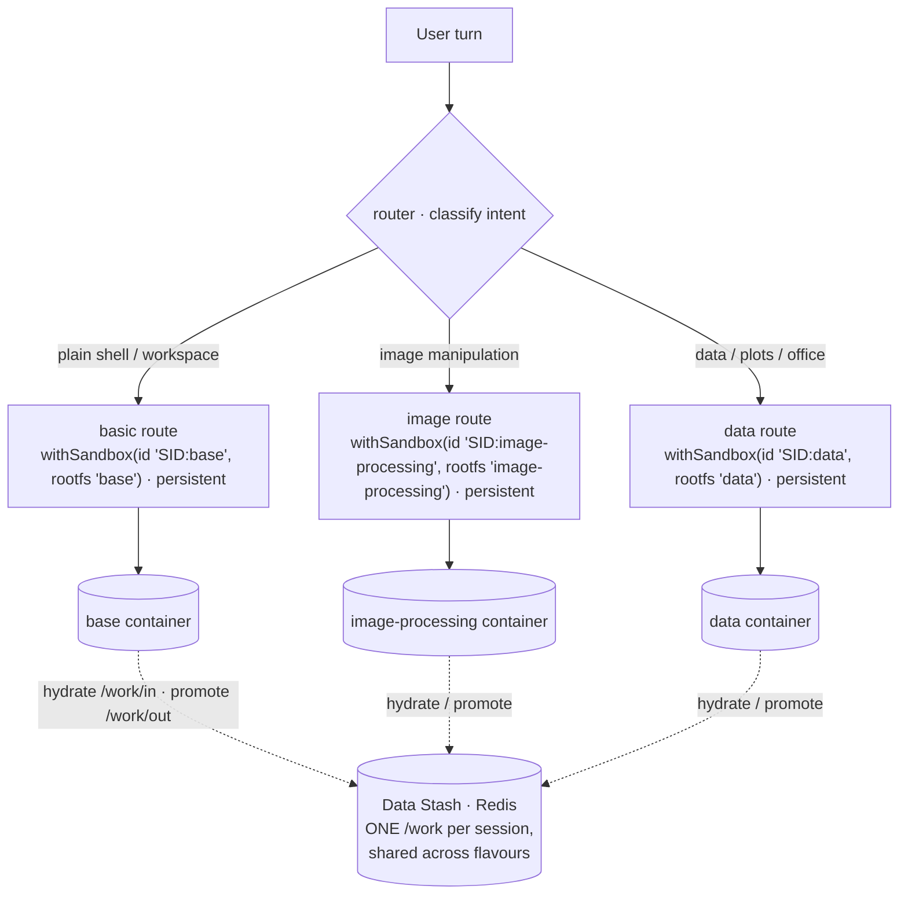

# Sandbox flavours & runtime selection — design note

> **Status:** the `image-processing` + `data` flavours and a router demonstrator
> ship in this PR; the hardening/ergonomics items are tracked in
> [#116](https://github.com/mknw/harness-playground/issues/116). Tracks
> [#78](https://github.com/mknw/harness-playground/issues/78). Companion to
> [`plan/sandbox.md`](plan/sandbox.md) and [`data-flow.md`](data-flow.md)
> (attachment lifecycle + `/work` ⇄ Data Stash).

## Problem

Sandbox v0 shipped one rootfs, `base` ([`rootfs/Dockerfile`](../rootfs/Dockerfile)):
`node:22-bookworm-slim` + `python3`/`pip`/`venv` + `curl` + the two in-VM MCP
servers. No image/data/office tooling, and the default `egress: 'mcp-only'` sets
`--network none` ([`docker-backend.server.ts`](../app/src/lib/sandbox/docker-backend.server.ts)),
so the actor can't install packages at runtime either. Image processing, data
analysis, and office-document generation were effectively blocked.

## Flavours (this PR)

Two purpose-split flavours, each `FROM kg-sandbox:base`, built by
[`rootfs/build.sh`](../rootfs/build.sh):

| Flavour                | Adds                                                                                                                                                               | For                                                |
| ---------------------- | ------------------------------------------------------------------------------------------------------------------------------------------------------------------ | -------------------------------------------------- |
| **`image-processing`** | numpy, Pillow, OpenCV (Debian `python3-opencv`) + **imagemagick**                                                                                                  | image manipulation                                 |
| **`data`**             | pandas, numpy, polars, pyarrow, matplotlib, seaborn + excel backends (openpyxl, fastexcel, xlsxwriter) + python-docx, python-pptx, reportlab, pypdf (via **`uv`**) | data analysis, plots, office/pdf generation        |
| **`office`**           | python-docx (Word), openpyxl + xlsxwriter (Excel), PyMuPDF (PDF read/edit/create) (via **`uv`**)                                                                   | editing MS-Office documents & PDFs as deliverables |

Excel backends in `data`: pandas reads/writes xlsx via **openpyxl**; polars'
`read_excel` needs **fastexcel** (the calamine engine); **xlsxwriter** is the
write engine for `pd.ExcelWriter` / `pl.DataFrame.write_excel`.

- **`base` stays the default rootfs;** flavours are opt-in via `withSandbox({ rootfs })`.
- Both keep `sandbox_bash` and `mcp-only` egress (no network) for now.
- **On the `data`/`image-processing` split:** `data` deliberately omits the heavy CV
  libraries (`opencv`/`scikit-image`). Note that **Pillow still arrives in `data`
  transitively** — matplotlib (required by seaborn) hard-depends on it — so the
  split is really "no OpenCV in `data`", not "no Pillow". Truly Pillow-free `data`
  would mean dropping matplotlib/seaborn.
- **Why `image-processing` uses apt, not `uv`:** the `opencv-python` wheel SIGILLs
  on import on arm64/colima (illegal instruction — the same class as the RediSearch
  arm64 crash). Debian's `python3-opencv` (+ matched `python3-numpy`/`python3-pil`)
  is compiled for a baseline ISA and imports cleanly. `data`'s uv wheels don't
  SIGILL, so it stays on `uv`.

## What already existed (the plumbing)

- `RootfsId` is an open string; widened here to `'base' | 'image-processing' | 'data' | (string & {})` ([`types.ts`](../app/src/lib/sandbox/types.ts)).
- `imageForRootfs` maps `base` → `SANDBOX_IMAGE` and falls through to `kg-sandbox:${rootfs}` — no backend change to add a flavour ([`docker-backend.server.ts`](../app/src/lib/sandbox/docker-backend.server.ts)).
- `WarmPool` is keyed by rootfs flavour, segmented by the posture fingerprint `tenantId|rootfs|egress` ([`warm-pool.server.ts`](../app/src/lib/sandbox/warm-pool.server.ts) — a pool handoff must match all three; a mismatch is a cold-boot); caps added for the new flavours in `DEFAULT_SETTINGS.sandbox.warmPool`.

## The composable recipe — router over flavoured sandboxes

`withSandbox(config)(pattern)` returns a `ConfiguredPattern`; `router(name→description)`

- `routes(name→pattern)` compose them. A route can be a flavoured, sandboxed
  controller — so flavour selection lives entirely in the harness. The demonstrator
  ([`agents/flavoured-sandbox.server.ts`](../app/src/lib/harness-client/agents/flavoured-sandbox.server.ts)):

```ts
// N flavour containers, ONE session workspace: every route is id-addressable
// (`${sessionId}:${rootfs}`) and workspace-synced, so /work/in holds the
// session's files whichever flavour the router picks for a turn.
const basic = withSandbox({
  id: `${sessionId}:base`,
  sessionId,
  rootfs: "base",
  egress: "mcp-only",
  syncWorkspace: true,
})(loop);
const image = withSandbox({
  id: `${sessionId}:image-processing`,
  sessionId,
  rootfs: "image-processing",
  egress: "mcp-only",
  syncWorkspace: true,
})(loop);
const data = withSandbox({
  id: `${sessionId}:data`,
  sessionId,
  rootfs: "data",
  egress: "mcp-only",
  syncWorkspace: true,
})(loop);

return [
  router({ basic: '…', image_processing: '…', data: '…' }, { route: baml.router }),
  routes({ basic, image_processing: image, data }),
  compactExecution({ mode: 'thread', synthesize: baml.synthesize }),
]
```

> **Why the `basic` route is not the ephemeral one any more (#243 follow-up).**
> It used to be `withSandbox({ rootfs: 'base', sessionId })` — the anonymous-pool
> path, a reset box per turn. But `syncWorkspace` only runs on the id-addressable
> path, so that route had **no `/work/in` at all**. Because the flavour is chosen
> **per turn**, a session could ingest a spreadsheet on a `data` turn and then be
> routed to `basic` for "list the files in /work/in", landing in a container where
> the directory had never been created: `No such file or directory (os error 2)`,
> six retries, run failed (`.harness-logs/243.json`). Per-turn flavour choice is
> the whole point of this recipe, so it is the **workspace** that has to be
> session-wide, not the routing. Ephemerality is still available (below) — it is
> just incompatible with a durable workspace, and a router that can switch
> flavours mid-conversation needs the workspace more than it needs the reset.



Why it fits the current primitives (verified in source):

- **Only the matched route boots.** `routes()` dispatches a single
  `patternMap[routeName]` (`router.server.ts:238`), so only the selected flavour's
  `withSandbox` fn runs → one container per turn, no fan-out.
- **Capabilities flow through composition.** `routes()` exposes
  `children: Object.values(patternMap)` (`router.server.ts:277`) and `withSandbox`
  exposes `children:[pattern]` + stamps its `syncWorkspace` marker — so
  `agentUsesSyncWorkspace` / `agentUsesRedisRetriever` work on a hand-composed agent.

## Ephemerality is orthogonal to flavour

Whether a sandbox is **ephemeral** (`fresh` or the anonymous-pool path — reset per
turn) or **persistent** (`id` + `syncWorkspace` — parked across turns) is a
_per-call_ argument, not a property of the flavour. Any flavour can be used either
way, and **multiple persistent flavours can coexist in one session**: use a
flavour-scoped attachment id `id = ${sessionId}:${rootfs}` (distinct container per
flavour) while keeping `sessionId` (the Data Stash key) the conversation id — so
`/work` hydrate/promote is shared across the flavoured containers, only in-VM
scratch differs. `id` and `sessionId` are _separate_ `withSandbox` params, so this
works today (the demonstrator does exactly this).

**But the two choices are not free of each other where a router is involved.**
`syncWorkspace` runs only on the id-addressable path, so _ephemeral_ means "no
`/work/in`, no promoted deliverables" — not merely "no in-VM scratch". Mixing an
ephemeral route into a set of workspace-synced ones gives a session whose
workspace **exists or not depending on which flavour the router happened to pick
this turn**, which is the #243 follow-up bug. Rule of thumb: in a multi-flavour
router, either every route is workspace-synced, or none is. An ephemeral sandbox
belongs in an agent (or a route) where no turn is expected to build on a prior
one. `withSandbox` now warns when `syncWorkspace` is passed without an `id`,
rather than ignoring it silently.

## Hardening & egress (shipped — [#116](https://github.com/mknw/harness-playground/issues/116) security bullets)

The three security bullets of #116 are implemented; the flavour-ergonomics
bullets (flavour-in-identity, flavour-aware Shell, per-flavour tool surface)
stay deferred below. What shipped:

- **Advisory host-side command allow/denylist for `sandbox_bash`**
  (`app/src/lib/sandbox/bash-guard.ts`). Every actor-authored command is
  screened in the transport before it reaches the VM: a narrow default deny
  set (container control, the docker socket, namespace/mount escapes, raw
  devices, the power commands), `SANDBOX_BASH_DENY` to replace it,
  `SANDBOX_BASH_ALLOW` to switch to allowlist mode. The harness's own
  work-sync commands (`mkdir`/`base64`/`find … sha256sum`/`rm`) are exempt **by
  caller** (`{ internal: true }` on the transport call), not by pattern —
  pattern exemptions rot the day work-sync learns a new command shape. Fails
  closed: non-string commands, unbuildable policies and throwing rules all
  deny; an invalid env regex fails the turn loudly. It is _advisory_ — it
  cannot parse shell — and says so in its header; the containment below is
  the boundary.
- **Kernel/container hardening** (`docker-backend.server.ts` → `hardeningArgs`).
  Every sandbox boots with `--cap-drop=ALL`, `--read-only` rootfs, RAM-backed
  writable `/work` + `/tmp` (sized, `nosuid`, `/work` mode 1777),
  `--pids-limit`, and `--security-opt no-new-privileges`; seccomp/AppArmor
  profiles are env opt-ins (`SANDBOX_SECCOMP_PROFILE` /
  `SANDBOX_APPARMOR_PROFILE`) — Docker's built-in default seccomp filter
  applies regardless. The images run everything as a **non-root `USER sandbox`**
  (the flavour Dockerfiles `USER root` for their build steps and drop back),
  with `HOME` on the /work tmpfs and a pre-owned `/cache`.
- **Egress enforcement** (`egress-policy.ts` + `rootfs/egress-proxy/proxy.mjs`).
  `mcp-only` → `--network none`; `open` → the default bridge, unrestricted and
  un-audited by design; `pypi` / `github-trusted` → an **internal-only docker
  network whose only way out is an allowlist CONNECT proxy** the backend runs
  beside the sandboxes — a process that ignores the proxy env vars has no
  route out at all, so the allowlist is enforced, not advisory. Every allowed
  AND denied connection is audited (one JSON line each:
  `docker logs kg-sandbox-egress-<profile>-gw`). `uv` is baked into the base
  image and `/cache` is a mounted named volume (env-tunable name), so live
  installs don't re-download wheels per container. An unknown profile at
  runtime fails CLOSED to no network.

Known edges, stated rather than implied: `open` has no audit trail (no
chokepoint to log at); DNS _resolution_ may still resolve depending on the
host's docker DNS behaviour (at most this reveals that a hostname exists —
connections are not routed); the proxy
tunnels HTTPS CONNECT only (plain-HTTP proxying is denied 405); and the
interactive terminal (`PtyManager`, `docker exec -it bash`) is a human-driven
path outside the `sandbox_bash` tool surface, so the command guard does not
screen it — its routes are owner-gated instead.

## Deferred (→ [#116](https://github.com/mknw/harness-playground/issues/116))

- **Flavour-in-identity.** Fold the `${id}:${rootfs}` convention _into_ `withSandbox`
  so callers can't forget it and silently reuse one container across flavours
  (today `AttachmentTable.acquire` reuses by `id`, ignoring `rootfs`). Ergonomic/safety,
  not a correctness blocker given the convention works now.
- **Flavour-aware Shell.** `PtyManager.start` acquires `(sessionId, 'base')`
  ([`pty-manager.server.ts`](../app/src/lib/sandbox/pty-manager.server.ts)) — with
  flavour-scoped agent containers the terminal opens a _separate_ base box (it still
  hydrates `/work/in` from the shared Data Stash, so it shows promoted deliverables
  but not the flavoured containers' live scratch). Make the tab pick a flavour and
  acquire `${sessionId}:${flavour}` (thread a `flavour` param through the PTY stream
  route, like `agentId`).
- **Per-flavour in-VM tool surface** — curate/drop `sandbox_bash` per flavour
  (whitelist capabilities, not command substrings). The host-side command
  policy above is flavour-agnostic for now.

**Avoid overlap:** ingest-side many→markdown _conversion_ (pdf/docx/odt → md, for
search) is handled by the `doc-convert` sidecar (see [`DATA_STASH.md`](DATA_STASH.md)
→ Document conversion). These flavours are about _executing code_ and _producing_
image/office deliverables — a different axis. The `office` flavour EDITS
docx/xlsx/pdf in-place (python-docx/openpyxl/PyMuPDF); true format _conversion_
(docx↔odt, →pdf via an office engine) still isn't covered — that's a deferred
LibreOffice service, not a flavour (prefer a service over baking it).
